<div align="center">


<h1>DevOps Accelerator</h1>

<p><strong>The Institutional-Grade Platform for Standardized CI/CD Foundations, Delivery Orchestration Governance, and Multi-Cloud Transformation Ecosystems.</strong></p>

[]()
[]()
[]()

<br/>

> **"Industrializing deployment delivery to automate continuous foundations."** 
> **DevOps Accelerator** is an enterprise-grade solution designed to provide a secure, measurable, and highly automated foundation for global engineering transformations. It orchestrates the complex lifecycle of modern delivery—from CI/CD pipeline instantiation and IaC automation to continuous deployment and unified operational auditing.

</div>

---

## 🏛️ Executive Summary

Fragmented delivery silos and manual deployment scripting are strategic operational liabilities; lack of centralized CI/CD orchestration is a primary barrier to organizational cloud maturity and engineering velocity. Organizations fail to maintain a secure delivery foundation not because of a lack of tools, but because of fragmented deployment standards, lack of automated pipeline validation, and an inability to orchestrate continuous planes with operational precision.

This repository provides the **Delivery Intelligence Plane**. It implements a complete **DevOps-Accelerator-as-Code Framework**, enabling Transformation and Platform teams to manage global CI/CD foundations as first-class citizens. By automating the identification of deployment bottlenecks through real-time pipeline analysis and orchestrating the provisioning of secure performance-driven delivery policies, we ensure that every organizational application—from legacy monoliths to modern serverless functions—is deployed by default, audited for history, and strictly aligned with institutional continuous delivery frameworks.

---

## 📐 Architecture Storytelling: Principal Reference Models

### 1. Principal Architecture: Global DevOps Accelerator & Delivery Intelligence Plane
This diagram illustrates the end-to-end flow from pipeline ingestion and multi-cloud orchestration to delivery enforcement, performance validation, and institutional maturity auditing.

```mermaid
graph LR
    %% Subgraph Definitions
    subgraph DeliveryIngress["Code & Pipeline Ingress"]
        direction TB
        App_Repos["Microservices / Web / Mobile Code"]
        IaC_Repos["Terraform / Pulumi State"]
        Security_Guardrails["Pre-Commit / Linting Rules"]
    end

    subgraph IntelligenceEngine["Delivery Intelligence Hub"]
        direction TB
        API["FastAPI Delivery Gateway"]
        PipelineOrchestrator["Global CI/CD & Automation Hub"]
        Governance_Hub["Compliance & Release Guardrail Hub"]
        AIOps_Validator["Drift & Velocity Analysis Hub"]
    end

    subgraph OperationsPlane["Distributed Deployment Ecosystem"]
        direction TB
        ManagedEnvironments["Managed Standardized Cloud Environments"]
        ActiveDeployments["Managed Automated Delivery Pipelines"]
        ArtifactSinks["Managed Container & Package Hubs"]
    end

    subgraph OperationsHub["Institutional DevOps Hub"]
        direction TB
        Scorecard["Delivery Maturity Scorecard"]
        Analytics["Deployment Flow & Readiness Velocity Stats"]
        Audit["Forensic Delivery Metadata Lake"]
    end

    subgraph DevOps["DevOps-Accelerator-as-Code Framework"]
        direction TB
        TF["Terraform Delivery Modules"]
        DriftBot["Pipeline & Config Drift Validator"]
        ChatOps["Release Operations Hub"]
    end

    %% Flow Arrows
    DeliveryIngress -->|1. Submit Commit| API
    API -->|2. Orchestrate Pipeline| PipelineOrchestrator
    PipelineOrchestrator -->|3. Apply Release Guard| Governance_Hub
    Governance_Hub -->|4. Assess Drift| AIOps_Validator
    
    AIOps_Validator -->|5. Execute Deployment| OperationsPlane
    OperationsPlane -->|6. Notify Status| ChatOps
    API -->|7. Visualize Health| Scorecard
    
    Scorecard -->|8. Track Maturity| Analytics
    Scorecard -->|9. Record Deployment| Audit
    
    TF -->|10. Provision Backbone| IntelligenceEngine
    DriftBot -->|11. Inject Pipeline Risk| PipelineOrchestrator
    Audit -->|12. Improve Operations| ManagedEnvironments

    %% Styling
    classDef ingress fill:#f5f5f5,stroke:#616161,stroke-width:2px;
    classDef intel fill:#e8eaf6,stroke:#1a237e,stroke-width:2px;
    classDef operations fill:#e1f5fe,stroke:#01579b,stroke-width:2px;
    classDef ops fill:#ede7f6,stroke:#311b92,stroke-width:2px;
    classDef devops fill:#e8f5e9,stroke:#1b5e20,stroke-width:2px;

    class DeliveryIngress ingress;
    class IntelligenceEngine intel;
    class OperationsPlane operations;
    class OperationsHub ops;
    class DevOps devops;
```

### 2. The Delivery Lifecycle Flow
The continuous path of a DevOps accelerator from initial planning (agile) and build (CI) to active automate (IaC), deliver (CD), and institutional forensic auditing (DORA).

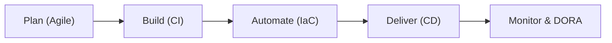

### 3. Distributed Accelerator Topology
Strategically orchestrating standardized CI/CD pipelines across global engineering hubs, diverse Git repositories, and multi-cloud targets, providing a unified institutional view of global deployment health.

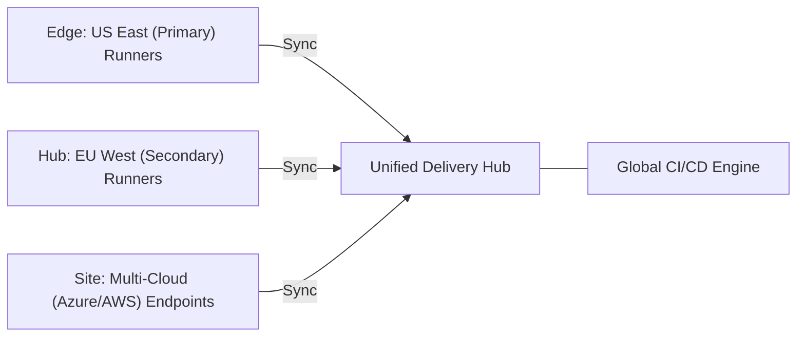

### 4. Delivery Governance & High-Trust Data Plane Protection Flow
Executing complex logic for securing the bridge between code repositories, build runners, and production environments, ensuring every organizational identity is verified and every deployment access is according to institutional standards.

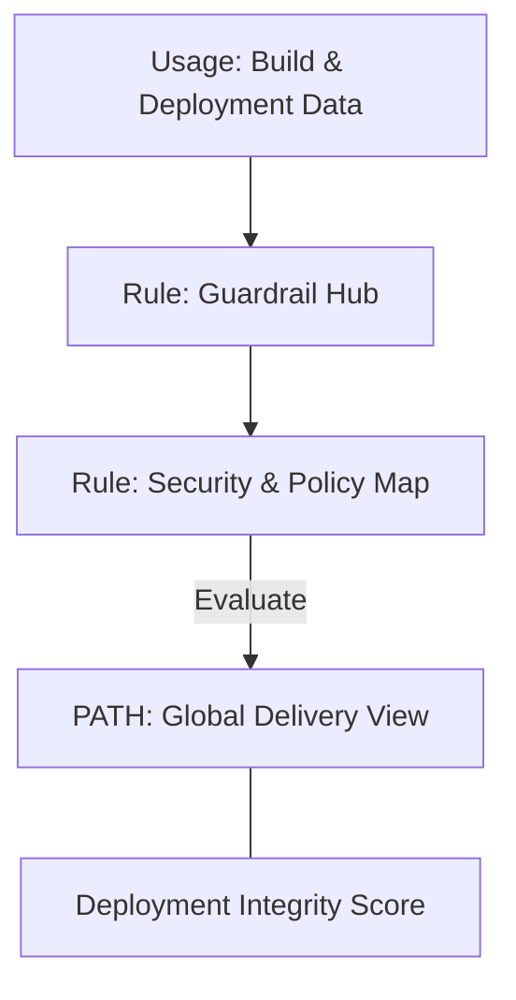

### 5. Multi-Cloud Delivery Federation & Governance Flow
Automatically managing unified CI/CD standards across global regions and diverse cloud targets, ensuring institutional pipeline consistency and security boundaries by default.

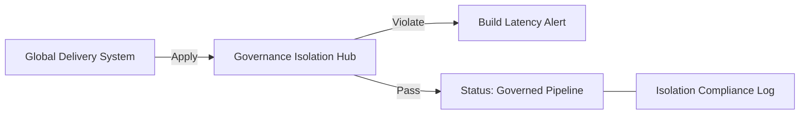

### 6. Encryption & Perimeter Protection Flow (Delivery Standard)
Managing the lifecycle of a deployment request, automatically enforcing institutional TLS 1.3 and resource encryption standards as required by security policy, ensuring zero-latency security confidence.

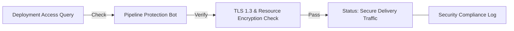

### 7. Institutional DevOps Maturity Scorecard
Grading organizational performance based on key indicators: Deployment Frequency, Deployment Lead Time, and Automation Adoption.

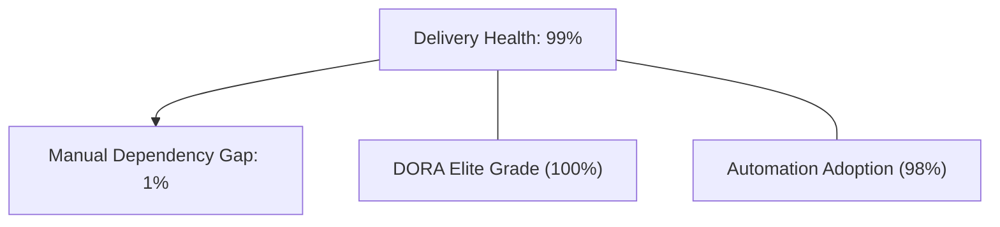

### 8. Identity & RBAC for Delivery Governance
Managing fine-grained access to CI/CD hubs, provisioning runners, and audit logs between Release Managers, Developers, and Operations Engineers.

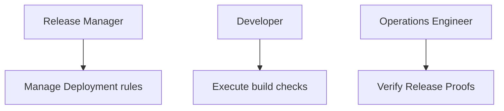

### 9. IaC Deployment: DevOps-Accelerator-as-Code Framework
Using modular Terraform to deploy and manage the versioned distribution of the delivery tracking hubs, policy protection workers, and forensic metadata lakes.

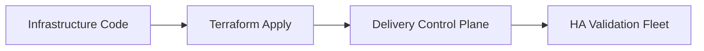

### 10. AIOps Delivery Drift & Risk Validation Flow
Using advanced analytics to identify sudden surges in build failures, unauthorized deployments, suspicious configuration drifts, or unusual delivery pattern changes that could result in institutional risk or downtime.

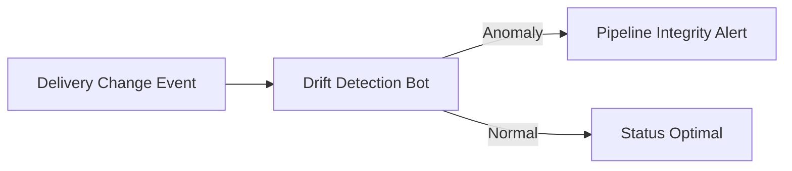

### 11. Metadata Lake for Forensic Delivery Audit
Storing long-term records of every deployment event generated (metadata), every pipeline execution triggered, and every release history for institutional record-keeping, compliance auditing, and post-provisioning forensics.

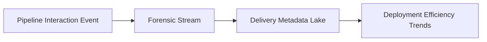

---

## 🏛️ Core Governance Pillars

1.  **Unified Foundation Coordination**: Maximizing velocity by centralizing all continuous delivery workflows through a single institutional plane.
2.  **Automated Pipeline Provisioning**: Eliminating "manual deployment" scenarios through proactive orchestration and template verification.
3.  **Sequential Delivery Intelligence**: Ensuring zero-interruption operations through dependency-aware CI/CD-driven platform engineering.
4.  **Zero-Trust Guardrail Protection**: Automatically enforcing identity-based access and rule evaluation across all deployment tiers.
5.  **Autonomous Operations Logic**: Guaranteeing reliability through automated industry-specific release monitoring runbooks.
6.  **Full Delivery Auditability**: Immutable recording of every build artifact and deployment provision for institutional forensics.

---

## 🛠️ Technical Stack & Implementation

### Delivery Engine & APIs
*   **Framework**: Python 3.11+ / FastAPI.
*   **Performance Engine**: Custom Python-based logic for multi-cloud CI/CD provisioning and DORA-style readiness metrics.
*   **Integrations**: Native connectors for GitHub Actions, GitLab CI, ArgoCD, and Terraform Enterprise.
*   **Persistence**: PostgreSQL (Delivery Ledger) and Redis (Live Pipeline State).
*   **Auth Orchestrator**: Federated OIDC/SAML for least-privilege release management access.

### Governance Dashboard (UI)
*   **Framework**: React 18 / Vite.
*   **Theme**: Dark, Slate, Indigo (Modern high-fidelity delivery aesthetic).
*   **Visualization**: D3.js for delivery topologies and Recharts for readiness velocity analytics.

### Infrastructure & DevOps
*   **Runtime**: AWS EKS or Azure Kubernetes Service (AKS) for management plane.
*   **Delivery Hub**: Managed event sourcing for immutable deployment timeline reconstruction.
*   **IaC**: Modular Terraform for deploying the delivery engine and validation fleet.

---

## 🏗️ IaC Mapping (Module Structure)

| Module | Purpose | Real Services |
| :--- | :--- | :--- |
| **`infrastructure/delivery_hub`** | Central management plane | EKS, PostgreSQL, Redis |
| **`infrastructure/runners`** | Distributed automation workers | Azure, AWS, GCP APIs |
| **`infrastructure/pipeline_pipes`** | Delivery Orchestration Hubs | Webhooks, GitHub Actions |
| **`infrastructure/auditing`** | Forensic delivery sinks | S3, Athena, Quicksight |

---

## 🚀 Deployment Guide

### Local Principal Environment
```bash
# Clone the DevOps Accelerator repository
git clone https://github.com/devopstrio/devops-accelerator.git
cd devops-accelerator

# Configure environment
cp .env.example .env

# Launch the Delivery stack
make init

# Trigger a mock CI/CD request and automated guardrail validation simulation
make simulate-delivery
```

Access the Management Portal at `http://localhost:3000`.

---

## 📜 License
Distributed under the MIT License. See `LICENSE` for more information.

---
<div align="center">
  <p>© 2026 Devopstrio. All rights reserved.</p>
</div>
