<div align="center">


<h1>DevOps Accelerator</h1>

<p><strong>The Enterprise Standard for Rapidly Establishing Modern DevOps Practices and Multi-Cloud Operating Models</strong></p>

[]()
[]()
[]()
[]()

<br/>

> **"DevOps is not a goal, but a never-ending process of continual improvement."** 
> DevOps Accelerator is a flagship platform designed to enable enterprises to rapidly establish, automate, and govern modern engineering practices across multi-cloud and hybrid estates.

</div>

---

## 🏛️ Executive Summary

**DevOps Accelerator** is a flagship repository designed for Chief Information Officers (CIOs), CTOs, and Transformation Leaders. In the modern enterprise, the ability to deliver software with high velocity, quality, and security is the primary competitive differentiator.

This platform provides an industrialized approach to **DevOps Transformation**, delivering production-ready **CI/CD Blueprints**, **GitOps Operating Models**, **Infrastructure as Code Standards**, and **Developer Self-Service Portals**. It supports **Azure**, **AWS**, **GCP**, and **Kubernetes**, enabling organizations to transition from "Siloed Delivery" to "Standardized Platform Engineering."

---

## 💡 Why DevOps Matters

DevOps is the engine of digital transformation:
- **Velocity**: Accelerating the "Idea-to-Production" lifecycle through automated delivery pipelines.
- **Reliability**: Improving system stability by implementing automated testing and GitOps reconciliation.
- **Security**: Integrating security and compliance checks into the earliest stages of development (Shift-Left).
- **Efficiency**: Reducing manual toil and environmental friction through developer self-service and automation.

---

## 🚀 Business Outcomes

### 🎯 Strategic Delivery Impact
- **Industrialized Pipelines**: Standardizing how applications are built, tested, and released across the global org.
- **Reduced Time-to-Market**: Eliminating manual approvals and environmental bottlenecks.
- **Improved Governance**: Ensuring every change is versioned, audited, and compliant with enterprise standards.
- **Talent Empowerment**: Enabling engineers to focus on code rather than infrastructure complexity.

---

## 🏗️ Technical Stack

| Layer | Technology | Rationale |
|---|---|---|
| **Automation Engine** | Python, GitHub Actions | High-performance orchestration of CI/CD lifecycles and platform provisioning. |
| **Control Plane** | FastAPI | High-performance API for request management and delivery orchestration. |
| **Frontend** | React 18, Vite | Premium portal for pipeline visibility, release governance, and cost insights. |
| **IaC Foundation** | Terraform | Multi-cloud infrastructure consistency and platform foundation automation. |
| **Database** | PostgreSQL | Centralized repository for delivery metadata, integration state, and history. |
| **Observability** | Prometheus / Grafana | Real-time monitoring of delivery frequency, failure rates, and platform health. |

---

## 📐 Architecture Storytelling: 70+ Diagrams

### 1. Executive High-Level Architecture
The holistic vision of the enterprise DevOps transformation journey.

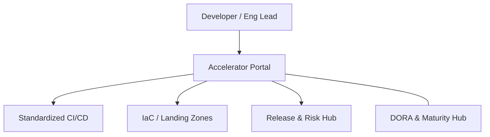

### 2. Detailed Component Topology
The internal service boundaries and management layers of the platform.

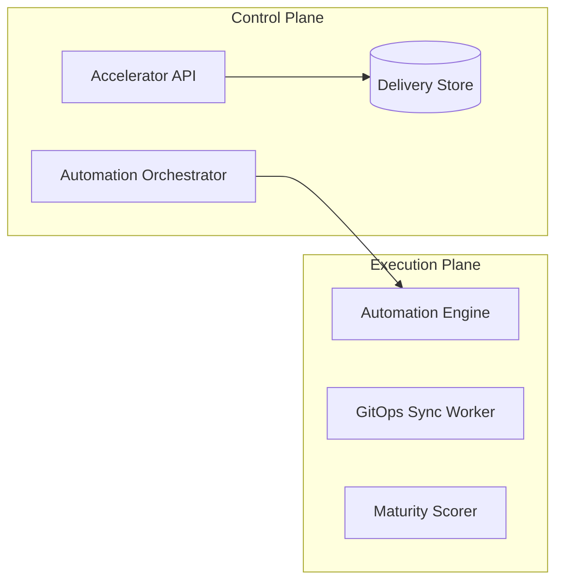

### 3. Developer to Production Request Path
Tracing a code change through the industrialized delivery stack.

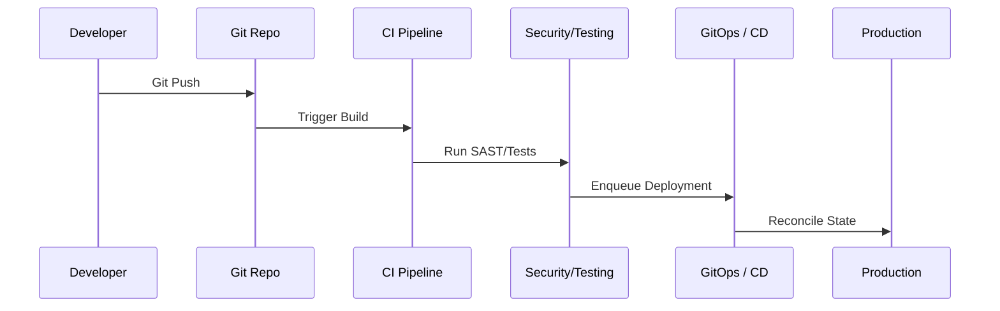

### 4. DevOps Control Plane
The "Brain" of the framework managing global delivery definitions.

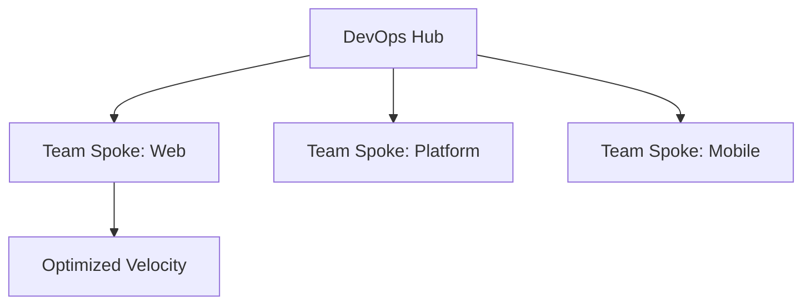

### 5. Multi-Cloud Topology
Synchronizing delivery standards across Azure, AWS, and GCP.

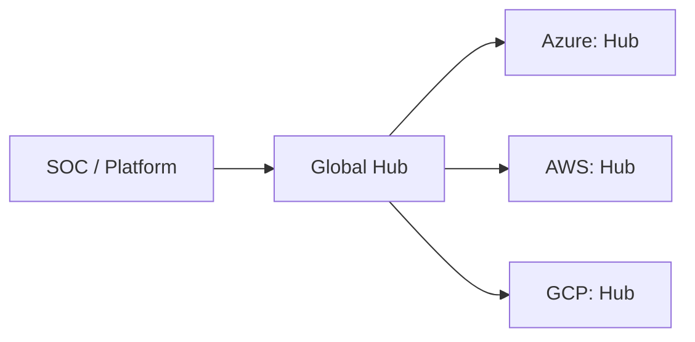

### 6. Regional Deployment Model
Hosting delivery workers close to the target environments for performance.

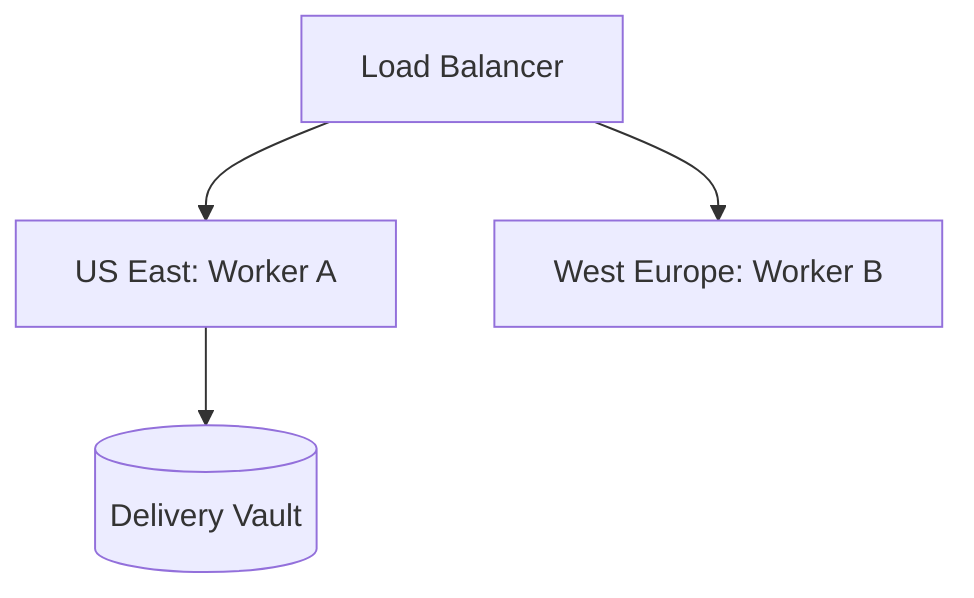

### 7. DR Failover Model
Ensuring transformation continuity during regional cloud outages.

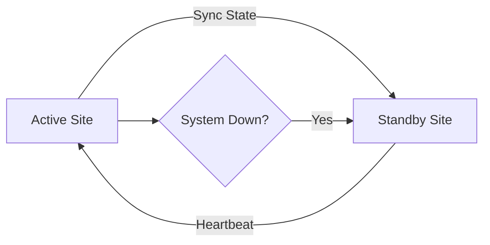

### 8. API Gateway Architecture
Securing and throttling the entry point for delivery orchestration.

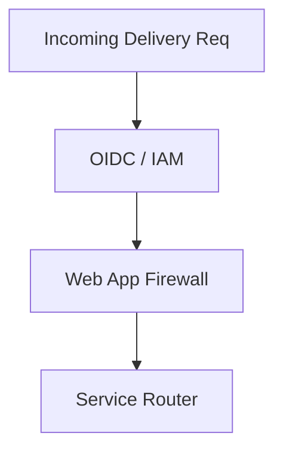

### 9. Queue Worker Architecture
Managing long-running provisioning and sync tasks at scale.

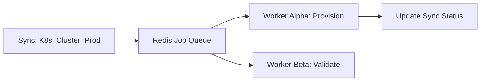

### 10. Dashboard Analytics Flow
How raw delivery telemetry becomes executive transformation scorecards.

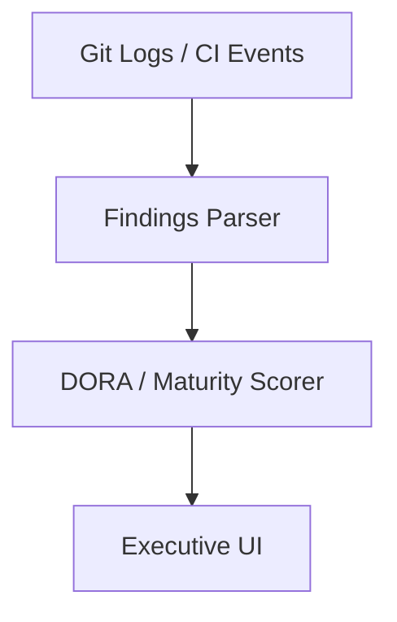

### 11. Commit to Deploy Workflow
The end-to-end journey of a code change.

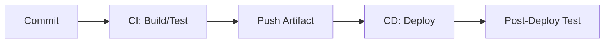

### 12. PR Validation Pipeline
Ensuring quality before merging to the main branch.

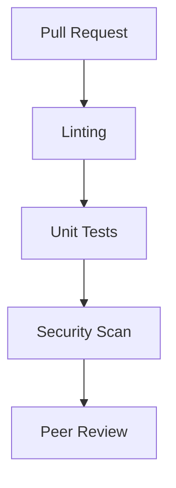

### 13. Branching Strategy Model
The Git flow for enterprise engineering teams.

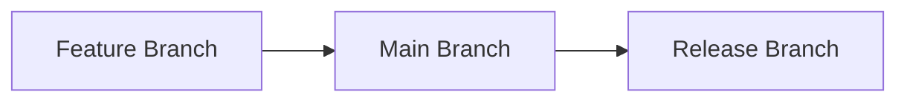

### 14. Artifact Packaging Flow
Standardizing binaries across languages.

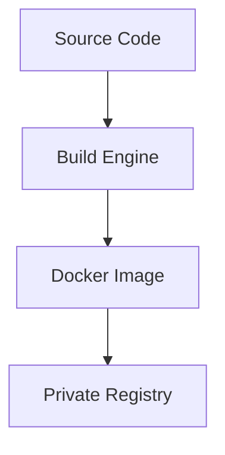

### 15. Versioning Lifecycle
Automated semantic versioning for releases.

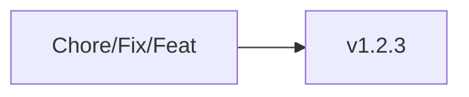

### 16. Release Approval Workflow
Governing production deployments with audit trails.

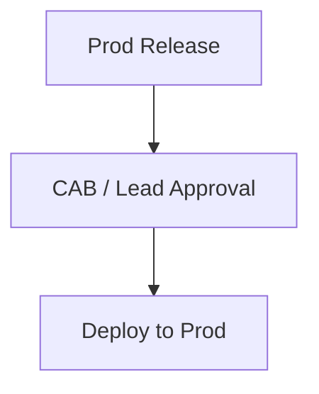

### 17. Blue/Green Deployment Model
Zero-downtime releases with instant rollback.

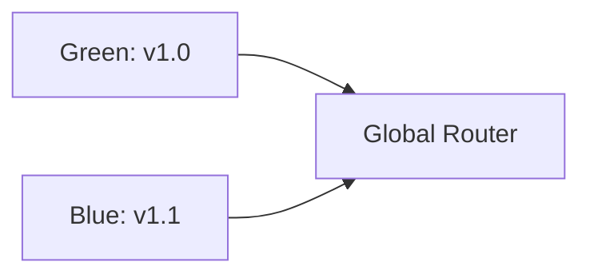

### 18. Canary Release Flow
Gradually exposing a new version to traffic.

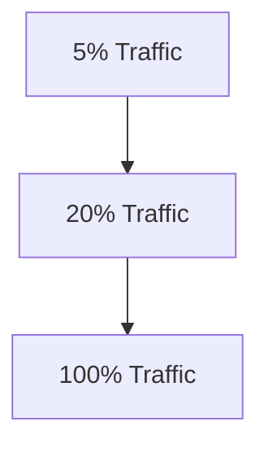

### 19. Rollback Lifecycle
Automated recovery during failed releases.

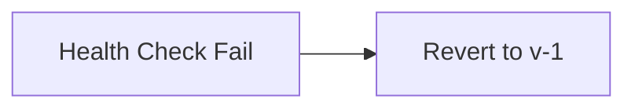

### 20. Release Calendar Governance
Managing deployment windows across the enterprise.

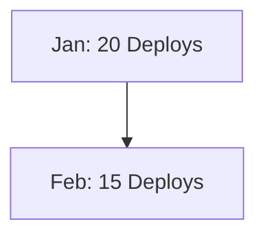

### 21. GitOps Reconciliation Loop
The core mechanism of declarative state management.

```mermaid
graph LR
    Git[Desired State] --> Sync[Sync Engine]
    Sync --> Cluster[Actual State]
    Cluster --> Sync
```

### 22. ArgoCD Sync Model
Managing Kubernetes state via GitOps.

```mermaid
graph TD
    Git[Git Repo] --> Argo[ArgoCD Controller]
    Argo --> K8s[Target Namespace]
```

### 23. FluxCD Pattern
The pull-based GitOps approach.

```mermaid
graph LR
    Flux[Flux Agent] --> Poll[Poll Git]
```

### 24. Golden Path Templates
Standardized starters for new applications.

```mermaid
graph TD
    Tmpl[React Template] --> App[New App Instance]
```

### 25. Self-Service Provisioning Flow
Enabling developers to spin up environments instantly.

```mermaid
graph LR
    User[Dev] --> Form[Catalog Request]
    Form --> Provision[Automated Terraform]
```

### 26. Internal Developer Portal Model
The single interface for all engineering tools.

```mermaid
graph TD
    Catalog[Service Catalog] --> Docs[Docs]
    Catalog --> Monitoring[Monitoring]
```

### 27. Backstage Integration Workflow
Connecting the platform hub to specialized tools.

```mermaid
graph LR
    Backstage[Backstage] --> Plugin[Snyk / PagerDuty]
```

### 28. Environment Promotion Model
The path from Development to Production.

```mermaid
graph TD
    Dev[Dev] --> Staging[Staging]
    Staging --> Prod[Production]
```

### 29. Platform API Architecture
The programmable interface for platform engineering.

```mermaid
graph LR
    Client[CLI/Portal] --> API[Platform API]
```

### 30. Shared Services Topology
Common infrastructure shared across teams.

```mermaid
graph TD
    Shared[Shared VPC] --> Team_A[Team A]
    Shared --> Team_B[Team B]
```

### 31. Terraform Module Structure
Standardizing infrastructure code blocks.

```mermaid
graph TD
    Root[Root Module] --> Net[Net Module]
    Root --> Compute[Compute Module]
```

### 32. Remote State Model
Managing Terraform state across distributed teams.

```mermaid
graph LR
    Local[Local Plan] --> Remote[S3/Azure Backend]
```

### 33. Multi-Account Landing Zone
Isolating environments at the cloud account level.

```mermaid
graph TD
    Org[Org Hub] --> Acc_Prod[Prod Account]
    Org --> Acc_Dev[Dev Account]
```

### 34. Network Hub-Spoke Architecture
Centralized networking with isolated spokes.

```mermaid
graph LR
    Hub[Hub: Shared Net] --> Spoke_A[App A VNet]
    Hub --> Spoke_B[App B VNet]
```

### 35. Kubernetes Cluster Topology
The internal structure of an enterprise K8s cluster.

```mermaid
graph TD
    Node[Node Pool] --> Pod[App Pods]
```

### 36. Serverless Deployment Flow
Deploying functions with high velocity.

```mermaid
graph LR
    Code[JS/Python] --> Lambda[AWS Lambda / Azure Func]
```

### 37. VM Patching Lifecycle
Automated OS updates for legacy workloads.

```mermaid
graph TD
    Check[Scan] --> Patch[Apply]
    Patch --> Verify[Verify]
```

### 38. Database Provisioning Model
Standardized DB deployment with backups enabled.

```mermaid
graph LR
    Req[Need SQL] --> DB[RDS / Flexible Server]
```

### 39. Secrets Management Workflow
Securing credentials using cloud-native vaults.

```mermaid
graph TD
    App[App] --> KV[Key Vault / Secrets Manager]
```

### 40. Drift Detection Lifecycle
Identifying manual changes to managed infrastructure.

```mermaid
graph LR
    TF[Terraform] --> Plan[Compare]
    Plan --> Drift[Drift Detected]
```

### 41. OIDC / SSO Auth Flow
Securing the accelerator portal with enterprise identity.

```mermaid
graph LR
    User[Eng Manager] --> Okta[Okta / Azure AD]
```

### 42. RBAC Model
Defining permissions for developers, leads, and admins.

```mermaid
graph TD
    Role[Developer] --> Action[Deploy to Dev]
```

### 43. SAST/DAST Pipeline Model
Integrating security scans into the CI/CD flow.

```mermaid
graph LR
    Code[Source] --> SAST[Static Scan]
    Build[Artifact] --> DAST[Dynamic Scan]
```

### 44. Supply Chain Security Flow
Verifying the integrity of 3rd party libraries.

```mermaid
graph TD
    Deps[NPM / PyPI] --> Scan[SCA Scan]
```

### 45. Vulnerability Remediation Cycle
From detection to patch deployment.

```mermaid
graph LR
    Detect[Detect] --> Issue[Jira Ticket]
    Issue --> Fix[Patch PR]
```

### 46. Incident Response Workflow
The DevOps approach to handling production issues.

```mermaid
graph TD
    Alert[PagerDuty] --> Slack[War Room]
    Slack --> RootCause[Post-Mortem]
```

### 47. SLO / Error Budget Model
Balancing velocity with reliability.

```mermaid
graph LR
    SLO[99.9% Uptime] --> Budget[0.1% Budget]
```

### 48. Metrics Pipeline
Monitoring the performance of the delivery platform.

```mermaid
graph TD
    App[Accelerator] --> Prom[Prometheus]
```

### 49. Logging Architecture
Centralized logs for delivery auditing.

```mermaid
graph LR
    Log[Build Log] --> Splunk[Splunk / ELK]
```

### 50. Tracing Model
Tracing distributed delivery workflows.

```mermaid
graph TD
    Step_1[Build] --> Step_2[Deploy]
```

### 51. DORA Metrics Scorecard
Measuring delivery performance (Velocity vs Quality).

```mermaid
graph LR
    DORA[DORA Score] --> Rating[Elite / High]
```

### 52. Lead Time Workflow
The time from code commit to production.

```mermaid
graph TD
    T1[Commit] --> T4[Production]
```

### 53. Deployment Frequency Trend
Tracking delivery volume over time.

```mermaid
graph LR
    Day[Mon] --> Deploys[15]
```

### 54. Change Failure Rate Model
Percentage of deployments causing issues.

```mermaid
graph TD
    Deploys[100] --> Fails[4]
```

### 55. MTTR Lifecycle
Time to restore service.

```mermaid
graph LR
    Down[Down] --> Up[Up]
```

### 56. Cost Allocation Workflow
Attributing cloud spend to specific teams.

```mermaid
graph TD
    Bill[Cloud Bill] --> Team[Team Alpha: $500]
```

### 57. Capacity Planning Model
Predicting future resource needs.

```mermaid
graph LR
    Trend[Growth] --> Forecast[Need 20 Nodes]
```

### 58. Team Benchmark Comparison
Comparing DevOps maturity across teams.

```mermaid
graph TD
    Team_A[A: 90%] vs Team_B[B: 70%]
```

### 59. Quarterly Planning Cycle
Aligning transformation goals.

```mermaid
graph LR
    Q1[GitOps] --> Q2[DORA Focus]
```

### 60. Executive KPI Review Cycle
Reporting results to leadership.

```mermaid
graph TD
    Stats[Stats] --> Deck[Executive Deck]
```

### 61. DevSecOps Operating Model
The integration of Security into DevOps.

```mermaid
graph LR
    Dev[Dev] --> Sec[Sec] --> Ops[Ops]
```

### 62. SRE + DevOps Alignment
Collaborating on reliability and velocity.

```mermaid
graph TD
    DevOps[Build/Deploy] --- SRE[Reliability]
```

### 63. AI Ops Recommendation Flow
Using ML to suggest delivery improvements.

```mermaid
graph LR
    Data[CI Logs] --> AI[AI Engine]
```

### 64. Automation Maturity Roadmap
The journey from manual to autonomous.

```mermaid
graph TD
    Level_1[Manual] --> Level_4[Autonomous]
```

### 65. Compliance Evidence Workflow
Automating audit data collection.

```mermaid
graph LR
    Deploy[Deploy] --> Evidence[Evidence Store]
```

### 66. Change Advisory Workflow
Modernized change management.

```mermaid
graph TD
    Edit[PR] --> Appr[Auto-Approve]
```

### 67. Training Enablement Model
Scaling DevOps knowledge across the org.

```mermaid
graph LR
    Kit[Training Kit] --> Team[Enable Team]
```

### 68. Portfolio Governance Cadence
Managing the transformation at scale.

```mermaid
graph TD
    Hub[Global Hub] --> Regions[Regional Hubs]
```

### 69. Global Operating Model
Operating across time zones and continents.

```mermaid
graph LR
    US[US Team] --> EU[EU Team]
```

### 70. Continuous Improvement Loop
The ultimate DevOps feedback cycle.

```mermaid
graph LR
    Measure[Measure] --> Improve[Improve]
    Improve --> Measure
```

---

## 🔬 DevOps Transformation Methodology

### 1. The DevOps Pillars
Our platform is built on four core pillars:
- **Velocity**: Delivering value faster through automation and lean processes.
- **Reliability**: Building stable systems through SRE principles and GitOps.
- **Security**: Embedding security into the core of the engineering lifecycle.
- **Self-Service**: Empowering developers through internal platform engineering.

### 2. DevOps vs. Platform Engineering
While DevOps focuses on the culture and practices of delivery, Platform Engineering provides the industrialized "Golden Paths" and tools that enable those practices at scale. This accelerator bridges that gap.

---

## 🚦 Getting Started

### 1. Prerequisites
- **Terraform** (v1.5+).
- **Docker Desktop**.
- **GitHub CLI** configured.

### 2. Local Setup
```bash
# Clone the repository
git clone https://github.com/Devopstrio/devops-accelerator.git
cd devops-accelerator

# Start the DevOps Control Plane
docker-compose up --build
```
Access the Accelerator Portal at `http://localhost:3000`.

---

## 🛡️ Governance & Security
- **Pipeline-as-Code**: All delivery definitions are versioned and audited.
- **Immutable Infrastructure**: Changes to the environment are only made via approved IaC pipelines.
- **Automated Evidence**: Every deployment generates a compliance record for audit readiness.

---
<sub>&copy; 2026 Devopstrio &mdash; Engineering the Future of Industrialized DevOps Transformation.</sub>
